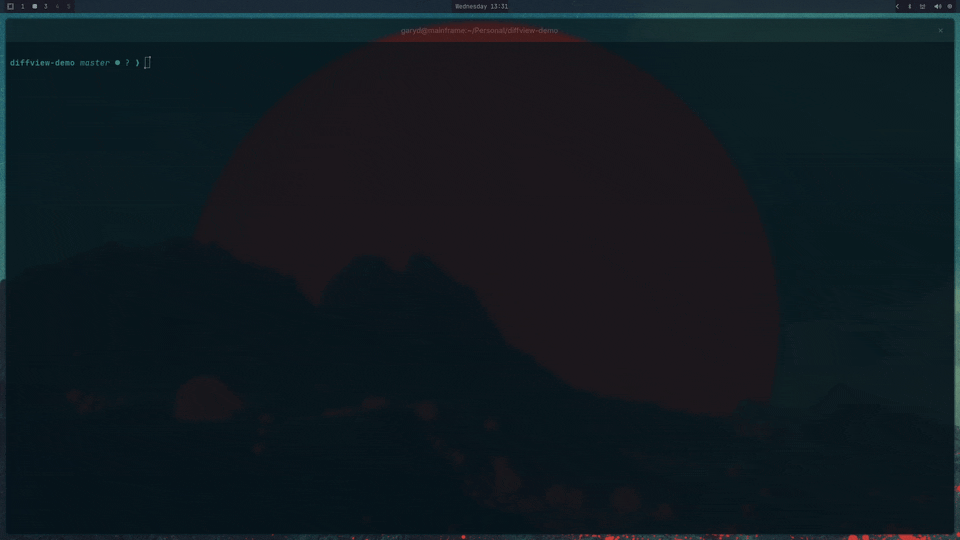

# diffview



Side-by-side terminal diff viewer for git output.

## Installation

From crates.io:

```bash
cargo install diffview
```

From GitHub:

```bash
cargo install --git https://github.com/dainduncan-dev/diffview
```

## Usage

Run against the current repo diff:

```bash
diffview
```

Pass through `git diff` arguments after `--`:

```bash
diffview -- --staged
```

Read from stdin:

```bash
git diff | diffview --stdin
```

Read from a diff file:

```bash
diffview --diff-file path/to/diff.txt
```

## Keys

- `j/k` or arrows: scroll
- `ctrl+u/d`: page up/down
- `n/p`: next/prev hunk
- `f/b`: next/prev file
- `1-9`: jump to file index
- `g/G`: top/bottom
- `u`: toggle untracked
- `q`: quit

## Notes

- Untracked view uses `git ls-files` and `git diff --no-index`.
